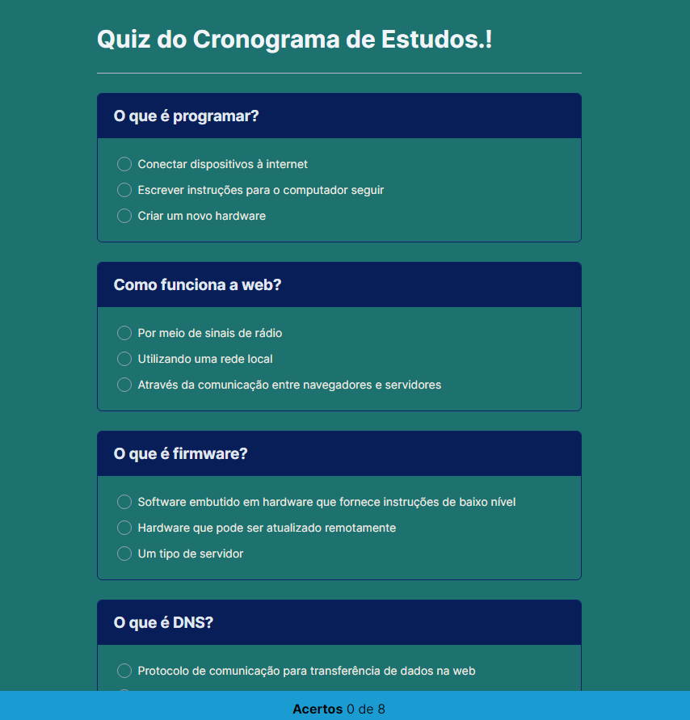

# Quiz Notion

Aplicação desenvolvida como desafio para responder um cronograma de estudos.

>Quiz do Cronograma de Estudos Notion

## 💻 Projeto

 Um quiz pra testar os seus conhecimentos técnicos e ter um retorno sobre a quantidade de questões que você acertou.

 ## 🔗 Deploy 

👉🏼[Link do projeto](https://quiz-notion.netlify.app/)

## 🚀 Tecnologias

Esse projeto foi desenvolvido com as seguintes tecnologias:

## 🔗 My Links

## 📝 Licença

Esse projeto está sob a licença MIT.